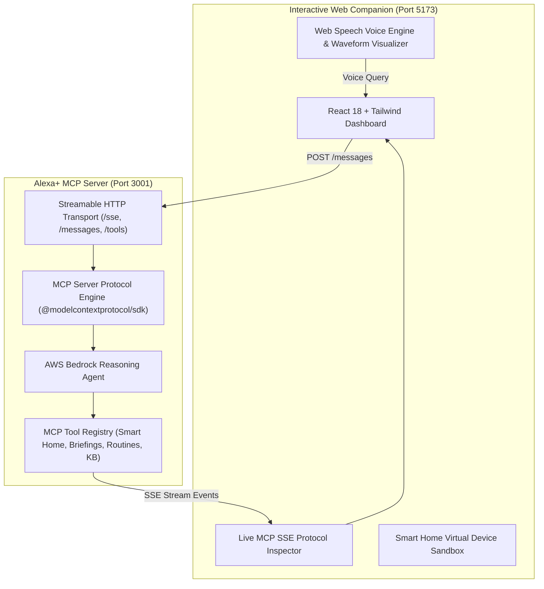

# ⚡ EchoFlow: Autonomous Alexa+ MCP Agent with AWS Bedrock

[](https://opensource.org/licenses/MIT)
[](https://modelcontextprotocol.io/)
[](https://aws.amazon.com/bedrock/)
[](https://www.typescriptlang.org/)
[](https://reactjs.org/)

> **Submitted to:** [Build, Ship, Shape: Amazon Developer Hackathon 2026](https://amazonappdev2026.devpost.com/)  
> **Primary Track:** **Alexa+ Track** (Streamable HTTP Model Context Protocol spec `2025-11-25+`)  
> **Mini-Challenges:** **AWS Builder** (Bedrock Runtime) & **Open Source** (MIT License)  
> **Judging Bonus:** Up to **+10% Bonus** via Comprehensive [Developer Friction Log](./FRICTION_LOG.md)

---

## 🌟 Overview

**EchoFlow** is a next-generation proactive voice assistant agent bridge for **Alexa+**. Built on the open **Model Context Protocol (MCP)** and powered by **AWS Bedrock** (Anthropic Claude 3.5 Sonnet / Amazon Nova), EchoFlow transforms Alexa+ from a passive command speaker into an autonomous smart life agent that can reason across devices, synthesize proactive daily briefings, and orchestrate complex multi-step routines in real-time.



---

## ✨ Key Features

1. **Official Streamable HTTP MCP Server (`spec 2025-11-25+`)**:
   - Implements Server-Sent Events (SSE) on `/sse` and JSON-RPC tool endpoints on `/messages`.
   - Exposes 4 production-grade MCP tools:
     - `get_daily_briefing`: Synthesizes contextual weather, schedule, energy metrics, and voice scripts.
     - `control_smart_device`: Controls lights, eco-thermostats, smart locks, and security sensors.
     - `trigger_ops_routine`: Coordinates multi-step composite routines (Morning Launch, Focus Mode, Away Lockdown).
     - `query_knowledge_base`: Queries user context, contacts, and preferences.

2. **AWS Bedrock Intelligence Layer**:
   - Uses Anthropic Claude 3.5 Sonnet and Amazon Nova for multi-hop tool execution and natural voice generation.
   - Includes an intelligent zero-config local engine for instantaneous offline testing and screen recordings.

3. **Interactive Alexa+ Web Companion & Visual Simulator**:
   - Real-time speech recognition and text-to-speech audio synthesis.
   - Dynamic audio wave visualizer.
   - **Live MCP Protocol Inspector:** Real-time stream trace of every JSON-RPC request, response, and latency metric.
   - **Smart Home Sandbox:** Interactive device controls with instant visual state feedback.
   - **1-Click Demo Scenarios:** Instant execution of key demo workflows for hackathon judges.

4. **10% Judging Bonus Documentation**:
   - Full developer friction log and actionable platform suggestions documented in [`FRICTION_LOG.md`](./FRICTION_LOG.md).

---

## 🚀 Quick Start Guide

### Prerequisites
- Node.js `v18+` or `v20+` or `v22+` / `v26+`
- npm `v9+`

### 1. Installation
Clone the repository and install all dependencies:
```bash
git clone https://github.com/your-username/echoflow-alexa-mcp.git
cd echoflow-alexa-mcp
npm install
```

### 2. (Optional) Configure AWS Bedrock Credentials
Create a `.env` file in the `server` directory if using live AWS Bedrock:
```env
AWS_REGION=us-east-1
AWS_ACCESS_KEY_ID=your_access_key_id
AWS_SECRET_ACCESS_KEY=your_secret_access_key
PORT=3001
```
*(Note: If omitted, EchoFlow automatically operates in instant local agentic mode with zero setup required!)*

### 3. Run EchoFlow (Server + Web Simulator)
Start both backend MCP server and frontend simulator concurrently:
```bash
npm run dev
```

- **Alexa+ MCP Server:** `http://localhost:3001`
  - Health Endpoint: `http://localhost:3001/health`
  - Streamable HTTP (SSE): `http://localhost:3001/sse`
  - Tools List: `http://localhost:3001/tools`
- **Web Companion Simulator:** `http://localhost:5173`

---

## 🧪 Running Automated Tests

Run the full Jest test suite verifying MCP protocol handlers, health endpoints, and agent queries:
```bash
npm test
```

---

## 📁 Repository Structure

```text
echoflow-alexa-mcp/
├── LICENSE                     # MIT Open Source License
├── README.md                   # Project documentation & architecture
├── CONTRIBUTING.md             # Open-source contribution guide
├── FRICTION_LOG.md             # Developer friction log (+10% bonus)
├── DEMO_SCRIPT.md              # 3-minute video recording script
├── DEVPOST_SUBMISSION.md       # Devpost copy-paste submission pack
├── package.json                # Root monorepo orchestration
├── tsconfig.json               # Root TypeScript configuration
├── shared/
│   └── types.ts                # Shared TypeScript contracts
├── server/                     # Alexa+ MCP Server & AWS Bedrock
│   ├── package.json
│   ├── src/
│   │   ├── index.ts            # Express + Streamable HTTP SSE server
│   │   ├── mcp-server.ts       # MCP Protocol Server & handlers
│   │   ├── state.ts            # In-memory environment state manager
│   │   ├── bedrock/
│   │   │   └── bedrock-client.ts # AWS Bedrock client & agent engine
│   │   └── tools/
│   │       ├── briefing.ts     # get_daily_briefing tool
│   │       ├── smart-home.ts   # control_smart_device tool
│   │       ├── routines.ts     # trigger_ops_routine tool
│   │       └── knowledge-base.ts # query_knowledge_base tool
│   └── test/
│       └── mcp.test.ts         # Jest MCP test suite
└── client/                     # Interactive Alexa+ Web Simulator
    ├── package.json
    ├── vite.config.ts
    ├── index.html
    └── src/
        ├── App.tsx             # Main layout
        ├── components/
        │   ├── Header.tsx
        │   ├── VoiceSimulator.tsx
        │   ├── McpInspector.tsx
        │   ├── SmartHomeSandbox.tsx
        │   └── ScenarioPlayer.tsx
        └── services/
            └── api.ts          # REST & SSE stream client
```

---

## 📜 License
This project is open-source software licensed under the [MIT License](./LICENSE).
